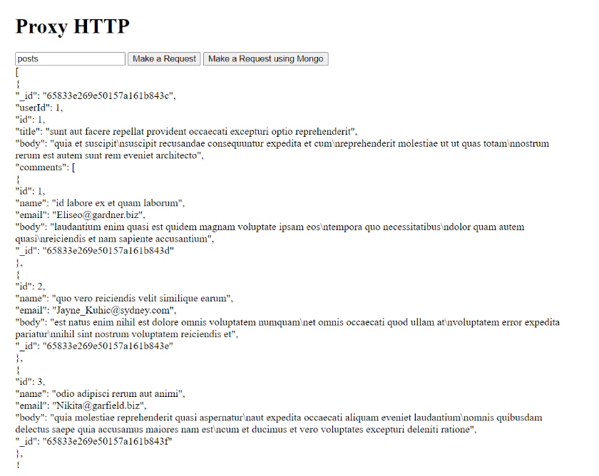
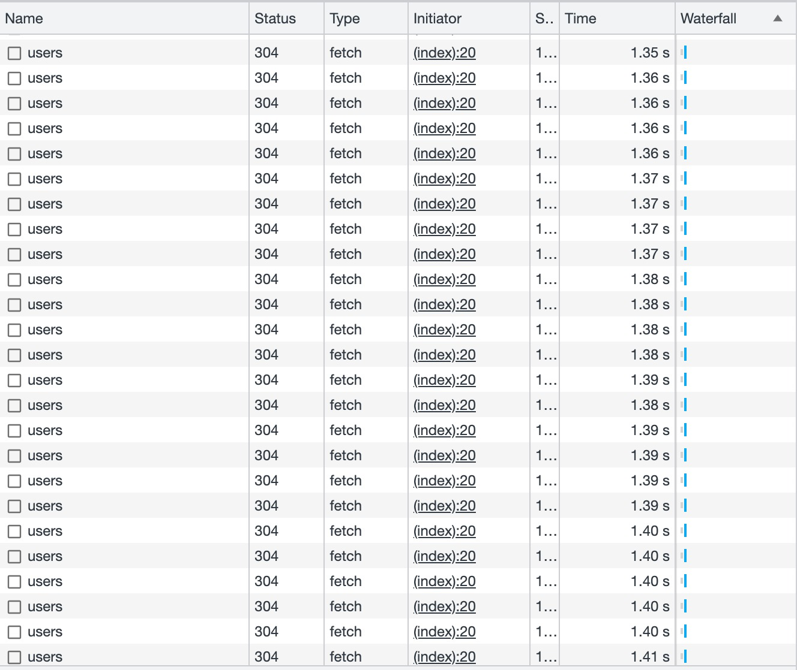
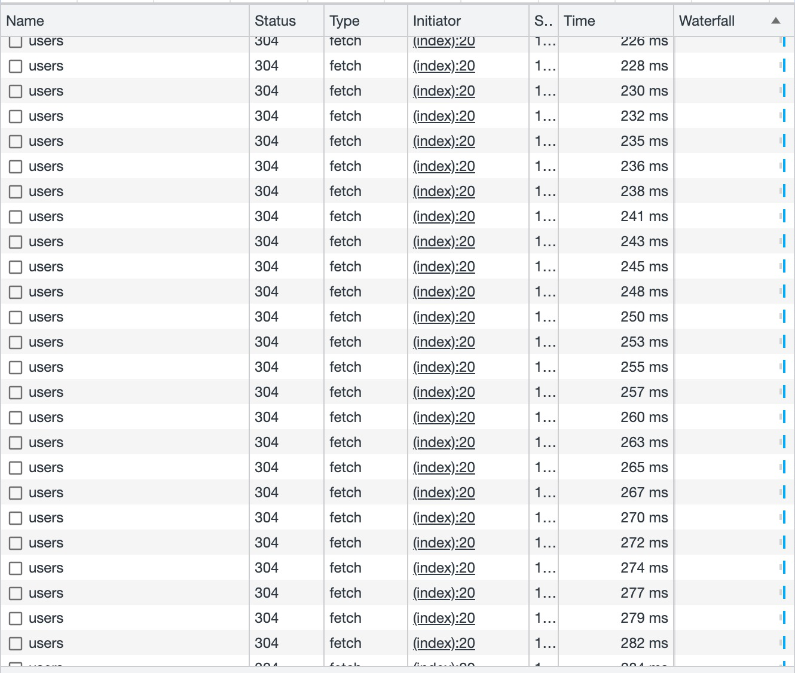

# Project Title : Request Cacher

## Description

This project is a request cacher for the 'users' and 'posts' endpoints that are located in a MongoDB database. The main aim of this project is to enhance performance by caching each HTTP GET request from an API endpoint. 

The caching process works as follows: When a request is made, the system first checks if the requested data exists in the Redis cache. If it does, the data is sent from Redis, providing a fast response time. If the data does not exist in Redis, the system retrieves it from the MongoDB database, stores it in Redis for future requests, and then sends the data. This approach significantly reduces the load on the MongoDB database and improves the overall performance of the API.


## Installation

To install and run this project locally, follow these steps:

1. Clone the repository:

   ```bash
   git clone https://github.com/merzakidriss/HTTP-Proxy.git
   ```

2. Navigate to the project directory:

   ```bash
   cd HTTP-Proxy
   ```

3. Install the dependencies:

   ```bash
   npm install
   ```


5. Start the server:

   ```bash
   npm run dev
   ```

6. The server should now be running on `http://localhost:3000`.


## Screenshots



## Performance checking

No caching used



Caching Used




